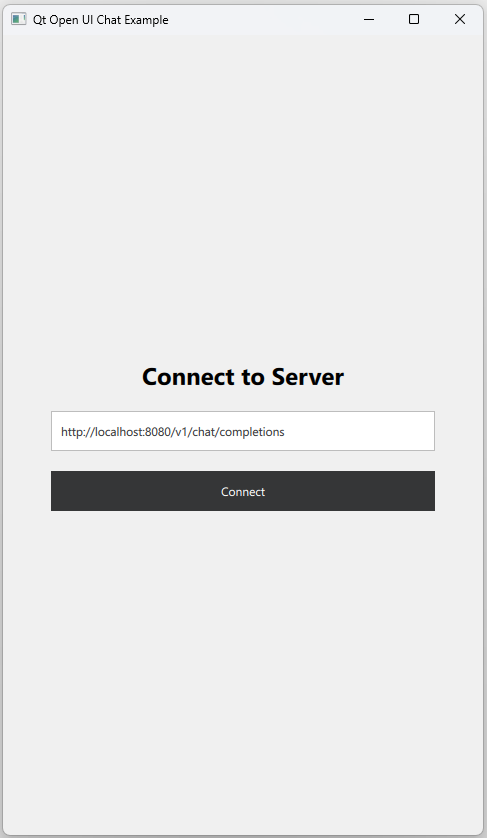
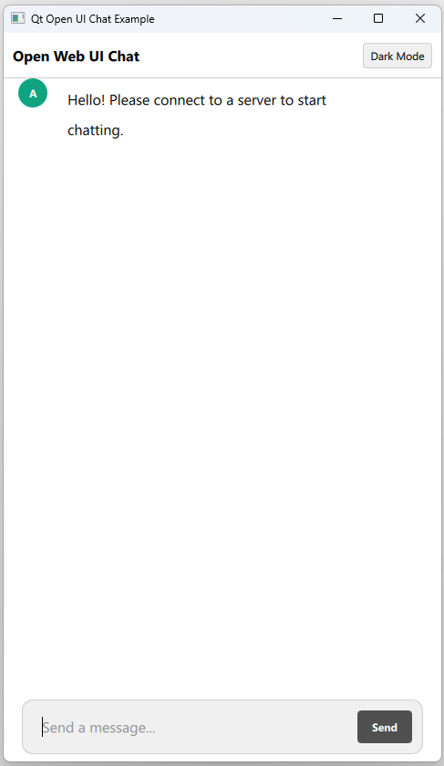
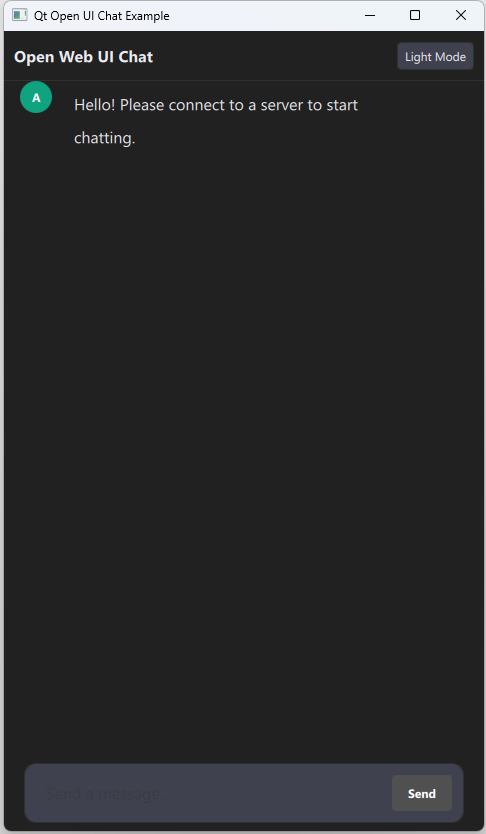

# Qt Open UI Chat

## Introduction

A C++ and QML based chat interface component and example application, designed to connect with LLM servers like Ollama.

| LLM Server | Light Theme | Dark Theme |
|-------------|-------------|------------|
|  |  |  |

## Features

- [x] Open web UI based design in Qt C++
- [x] Library support for rapid integration into applications
- [x] Configurable server API
- [ ] Ollama structure parsing and formatting

## Building from Source
### Prerequisites

- **CMake** (3.16+)
- **Qt 6.10+** (Core, Gui, Qml, Quick, Network, QuickControls2)
- **Compiler**: MSVC 2022 (Windows) or GCC/Clang (Linux)
- **Build Tool**: Ninja or Visual Studio

### Steps

1.  Clone the repository:
    ```bash
    git clone https://github.com/Biswajee/qt-open-ui-chat-components.git
    cd qt-open-ui-workspace
    ```

2.  Build using CMake:
    ```bash
    mkdir build && cd build
    cmake ..
    cmake --build . --config Release
    ```

3.  Run the application:
    -   **Windows**: `example\Release\qt-open-ui-chat.exe` (Dependencies are automatically deployed).
    -   **Linux**: `./example/qt-open-ui-chat`

## Setup Ollama
### Windows

Install Ollama on Windows by using below command.
```shell
winget install --id Ollama.Ollama
```

### Linux
Install Ollama on Linux by using below command.
```bash
curl -fsSL https://ollama.com/install.sh | sh
```
